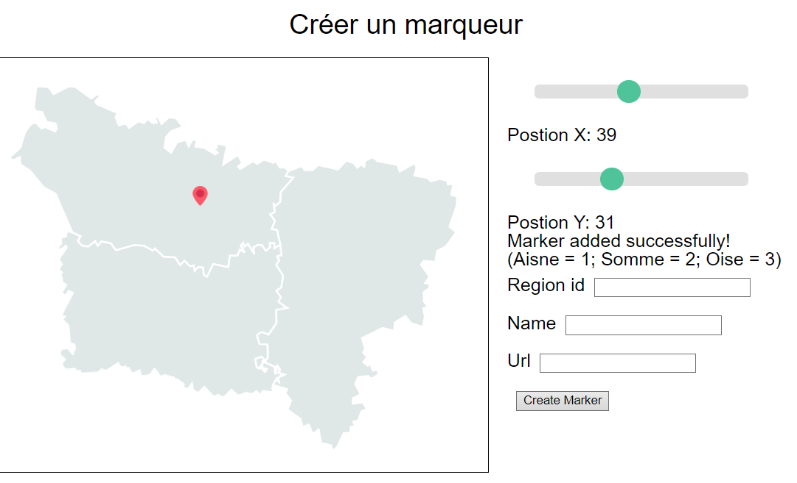

= Journal de bord "La Ruche"
:toc:
:toc-title: Sommaire
:sectnums:
:sectnumlevels: 1

== Jour 1 (22/01/24)
=== Creation d'une carte intéractive

Implémentation d'une carte au format .svg de la picardie. Possibilité de cliqué sur les différentes régions pour accéder à une page qui, plus tard, affichera les événements par régions.

=== Marqueurs
Ajout de l'entité marqueur qui vient récupérer toutes les informations de chaque marqueur afin de les placer sur la carte (placement un peu compliqué, à corriger). Les marqueurs sont également cliquable pour accéder à l'événement correspondent.

== Jour 2 (23/01/24)

=== Création Symfony

Refonte du cœur du projet pour le mettre sous symfony ce qui permettra d'améliorer la sécurité du site, mais également la facilité à créer des pages différentes pour chaque événement

=== Correction bug affichage marqueur
Modification du placement des marqueurs, maintenant, ils sont collés à la carte donc en cas de déplacement de celle-ci le marqueur pointera toujours à la même position, ce design s'adaptera également a chaque téléphone peu importe leur taille.

=== Sécurité

Ajout d'une entité admin ainsi que d'un formulaire de connexion et d'inscription sécurisé (avec restriction d'acces) exclusivement réserver aux administrateurs et non visible pour les utilisateurs. Pour y accéder : /admin

=== Css

Ajoute du package web-encore et scss permettant un affichage dynamique de la page web qui, lors de l'installation du site va regrouper tous les fichiers css créer en un seul afin de limiter l'utilisation des ressources du serveur

== Jour 3 (24/01/24)

=== Création de marker

Choix de la position des marqueurs avec 2 slider. +
Prévisualisation en direct sur la gauche en javascript. +
Sécurisation des champs pour empécher les injections sql (faille permettant de lire, modifié, supprimer des informations dans une base de donnée à partir d'un formulaire). +

=== Formulaire

Le formulaire necessite un id de région qui le liera à celle-ci, impossible de rentrer autre chose que 1, 2 ou 3 comme expliquer dans les parenthèses au-dessus du champ. +
Il faut renseigner le nom de la ville  et aussi l'url de renvoie lors d'un clique sur le marqueur. (champ url temporaire, il sera enlever lors de la création automatique des pages d'événements)

=== Popup

Maintenant quand on passe sa souris sur l'une des villes sont nom s'affichent

== Jour 4 (25/01/24)

=== Modification d'un marqueur

Contient deux formulaires, le premier permet de selectionner la ville à modifier. Une fois celle-ci choisis, un deuxième formulaire s'affiche, c'est le meme que pour la création d'un marqueur, mais il est préremplis avec les informations correspondantes

== Jour 5 (26/01/24)

== Jour 6 (29/01/24)
== Jour 7 (30/01/24)
== Jour 8 (31/01/24)
== Jour 9 (01/02/24)
== Jour 10 (02/02/24)

== Jour 11 (05/02/24)
== Jour 12 (06/02/24)
== Jour 13 (07/02/24)
== Jour 14 (08/02/24)
== Jour 15 (09/02/24)

== Jour 16 (12/02/24)
== Jour 17 (13/02/24)
== Jour 18 (14/02/24)
== Jour 19 (15/02/24)
== Jour 20 (16/02/24)

== Jour 1 (19/02/24)
== Jour 1 (20/02/24)
== Jour 1 (21/02/24)
== Jour 1 (22/02/24)
== Jour 1 (23/02/24)

